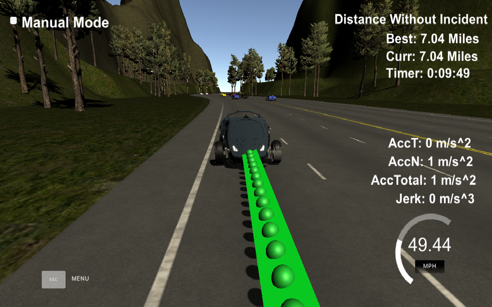

## Reflections

### Code Modules

These are the modules/classes in the Path Planner:

1. main - contains the Path Planner which works
2. constants - contains all the constants needed
3. spline - contains all the code related to make a smooth curve out of way points
4. coordinate_utils - contains all the utilities related to coordinates - like - calculating distance, convert cartesian to frenet and vice versa.
5. vehicle_action - a class representing vehicles state related to current velocity and lane it is in.
6. vehicle_controller - Class to handle vehicle's action based on the scenario like whether there is vehicle too close or is there any other lane available.
7. way_points_map - Contains the map of way points
8. vehicle - Contains the VehicleFusionData class which repsresents current vector of fusion.

### Code Walkthrough

1. Get the localization data for the car. Here is the localization data:["x"] The car's x position in map coordinates

   ["y"] The car's y position in map coordinates

   ["s"] The car's s position in frenet coordinates

   ["d"] The car's d position in frenet coordinates

   ["yaw"] The car's yaw angle in the map

   ["speed"] The car's speed in MPH

2. First we load the waypoints in the WayPointsMap. The code :

   ```c++
       WayPointsMap wayPointsMap;
       wayPointsMap.init(map_file_, max_s);
   ```


   ​

3. Get the sensor fusion data for the other cars. Here are sensor fusion parameters:
   A 2d vector of cars and then that car's [car's unique ID, car's x position in map coordinates, car's y position in map coordinates, car's x velocity in m/s, car's y velocity in m/s, car's s position in frenet coordinates, car's d position in frenet coordinates.

4. Then VehiceController comes under picture. It takes this sensor fusion data and prev_size and current lane. 

5. Then we use **VehiceController.is_too_close()** function to find out if any vehicle is very close, i.e. a in the gap of 30 meters. We use the sensor fusion data for the other cars and use the frenet value to predict the future Frenet value using constant speed and transpose it based on time elapsed.
   So, it takes sensor fusion vehicle and checks if vehicle is in the lane:

   ```c++
   vehicleFusionData.is_in_lane(lane)
   ```

   The way vehicleFusionData.is_in_lane() works is it gets car's d position and matches with the lane number - i.e.:

   ```c++
   is_in_lane = d < (2 + LANE_WIDTH * lane + 2) && d > (2 + LANE_WIDTH * lane - 2)
   ```

   Once done, it gets vehicle from sensor_fusion in the same lane and gets vehicle's s positin in frenet and projects it to the future assuming constant velocity and time elapsed:

   ```c++
   double check_car_s_proj = vehicleFusionData.check_car_s_projection(prev_size);
   ```

   and here is the code in the check_car_s_projection() method:

   ```
   this->check_car_s + double(prev_size) * 0.02 * this->check_speed
   ```

   Now that we have identified a vehicle from the sensor fusion which is in the same lane and also how far it will be from our vehicle, we have to check if it is not too close to us:

   ```c++
   if ((check_car_s_proj > car_s) && ((check_car_s_proj - end_path_s) < SAFETY_MARGIN)) {
                   return true;
               }
   ```

   Here safety margin is 30 meters.

6. Once we find out that there is vehicle in the lane, we can do 2 things - either switch lane or slow down in case we are unable to switch lanes. This is defined as VehicleAction, which contains velocity and lane car has to take.
   We do this in `VehicleController.take_vehicle_action()` method.

7. **If some vehicle is too close** - The VehicleController.take_vehicle_action() takes into account if vehicle is too close, current velocity and lane.
   If some vehicle is too close, it checks current lane. It then tries to switch to left lane. But it can only switch left lane only when it is not already in the left most lane:

   ```c++
   curr_lane != MIN_LANE
   ```

   and the left lane is available:

   ```
   is_lane_available(curr_lane-1)
   ```

   This is again same as is_too_close() method, but instead of using vehicle lane, we are assuming vehicle in the lane and see if there is any vehicle too close to this vehicle - either infront or behind - because there can be some vehicle from behind can also hit us. So, we use fabs:

   ```c++
   fabs(check_car_s_proj - car_s) < SAFETY_MARGIN
   ```

   If left is available we switch the lane, but if not. We repeat the same step for right. If right is available, its fine otherwise we have to now stay in the same lane.
   Once we are in the same lane, we have to slow down, and we slow down with -10m/s^2 to be on the safer side.

8. **If no vehicle is too close** - Then the car is king on the road. It checks if it is below the Max_vel then just increase the velocity, otherwise stay the same.

9. For switching the lane, we have to see the gap of the cars in the changing lane. The lane width is 4 meter. So, for instance if are to switch to left lane, then we have have to check if we are not already in the left most lane and also there is enough gap to switch to left. Likewise for the right lane.

10. Also, if the car is driving slowly or it has just started and if there is enough space in the lane, car will accelerate with 5 m/s^2.

11. Then we use spline to smoothen the car's curve. The way we do it is by adding previous points and then passing it to spline.

### How can I do better?

1. I should cleanup the code:
   a) I can follow more fo c++ convention as I sometimes manually created the class and sometimes used CLion, it is kind of mixed. So, code cleanup will help.
   b) I have created path_planner.h and cpp which will actually contain most of the code in main and main has to just call planner.getNextXYPoint() - which can be fed to simulator, so the implementatin becomes cleaner.
2. As mentioned in the rubric - to stand out - i could have used PID or MPC controller such that I feed the speed of the vehicle to the controller.

Here is the screenshot of simulator, this time I tested till 7 miles and vehicle's average speed was 43.02 miles per hour.




Thanks.


**Reference**

https://classroom.udacity.com/nanodegrees/nd013/parts/6047fe34-d93c-4f50-8336-b70ef10cb4b2/modules/27800789-bc8e-4adc-afe0-ec781e82ceae/lessons/23add5c6-7004-47ad-b169-49a5d7b1c1cb/concepts/3bdfeb8c-8dd6-49a7-9d08-beff6703792d