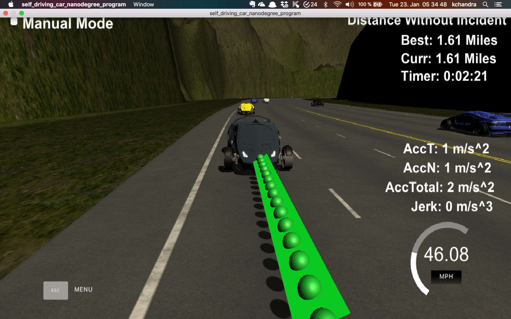

## Reflections

### Code Walkthrough

1. Get the localization data for the car. Here is the localization data:["x"] The car's x position in map coordinates

   ["y"] The car's y position in map coordinates

   ["s"] The car's s position in frenet coordinates

   ["d"] The car's d position in frenet coordinates

   ["yaw"] The car's yaw angle in the map

   ["speed"] The car's speed in MPH

2. Then we use spline to smoothen the car's curve. The way we do it is by adding previous points and then passing it to spline.

3. Get the sensor fusion data for the other cars. Here are sensor fusion parameters:
   A 2d vector of cars and then that car's [car's unique ID, car's x position in map coordinates, car's y position in map coordinates, car's x velocity in m/s, car's y velocity in m/s, car's s position in frenet coordinates, car's d position in frenet coordinates.

4. Use the sensor fusion data for the other cars and use the frenet value to predict the future Frenet value using constant speed transposed and time elapsed.

5. Now if the car in the same lane is very close, say a gap of 30 meters, we start to speed down and think about switching the lane. We use deceleration of 5 m/s^2.

6. For switching the lane, we have to see the gap of the cars in the changing lane. The lane width is 4 meter. So, for instance if are to switch to left lane, then we have have to check if we are not already in the left most lane and also there is enough gap to switch to left. Likewise for the right lane.

7. Also, if the car is driving slowly or it has just started and if there is enough space in the lane, car will accelerate with 5 m/s^2.

### How can I do better?

1. I could have used some kind of cost function - such that - I choose the lane based on the cost associated with it, choosing the lane with minimum cost.
2. As mentioned in the rubric - to stand out - i could have used PID or MPC controller such that I feed the speed of the vehicle to the controller.

Here is the screenshot of simulator

Thanks.